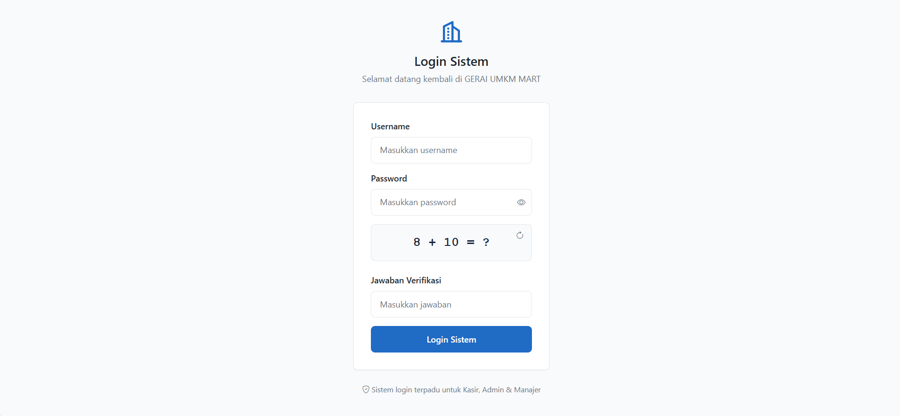
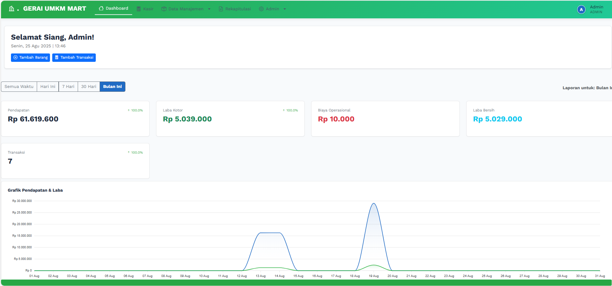
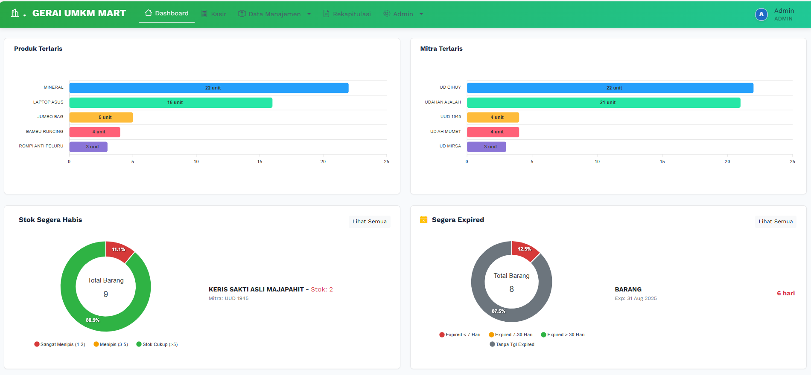
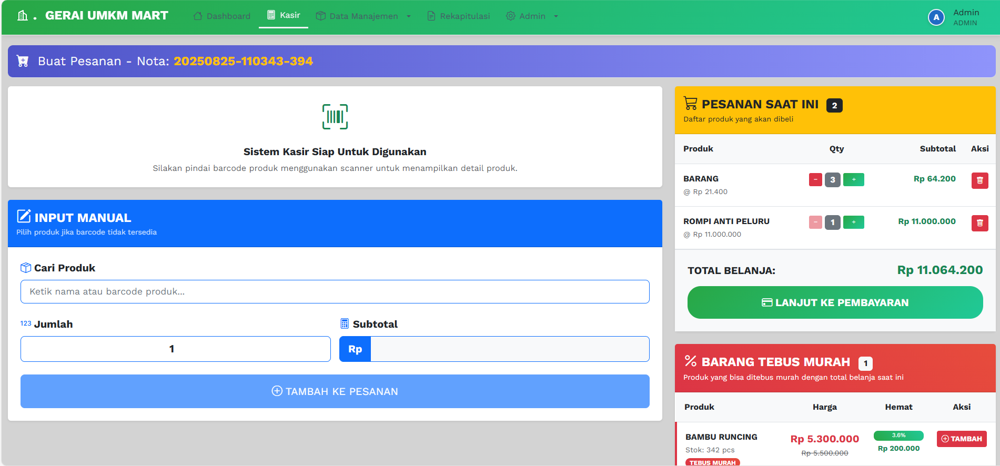

# 🏪 Gerai UMKM Mart - Sistem Manajemen Kasir & Inventaris

Gerai UMKM Mart adalah sistem manajemen kasir (Point of Sale) dan inventaris berbasis web yang dibangun menggunakan **Laravel 8**. Sistem ini dirancang khusus untuk memenuhi kebutuhan UMKM, terutama dalam mengelola penjualan produk yang berasal dari berbagai mitra binaan.

Tujuan utama dari sistem ini adalah untuk memodernisasi dan mempermudah proses pencatatan transaksi, manajemen stok, serta menyediakan analisis data penjualan yang akurat untuk mendukung pengambilan keputusan bisnis.

## ✨ Fitur Utama

### 📊 Dashboard Analitik
- Tampilan ringkasan performa bisnis secara visual
- Monitoring pendapatan, laba kotor & bersih
- Analisis produk terlaris
- Status inventaris kritis (stok menipis & barang akan expired)
- Dashboard khusus untuk setiap role pengguna

### 📦 Manajemen Produk
- **CRUD** lengkap data barang
- Pengelolaan stok, harga modal, dan harga jual
- Dukungan skema harga dinamis (harga grosir, tebus murah)
- Pencatatan tanggal masuk dan tanggal kedaluwarsa
- Kategori produk untuk organisasi yang lebih baik

### 🤝 Manajemen Mitra
- Pengelolaan data mitra (supplier) 
- Tracking produk berdasarkan mitra
- Riwayat kerjasama dengan mitra

### 💰 Sistem Kasir (Point of Sale)
- Antarmuka kasir yang intuitif dan responsif
- Pencatatan transaksi penjualan cepat dan akurat
- Dukungan multiple payment methods
- Cetak nota otomatis

### 📋 Manajemen Transaksi
- Riwayat transaksi lengkap
- Cetak ulang nota transaksi
- Manajemen status pembayaran
- Filter dan pencarian transaksi

### 📈 Manajemen Inventaris
- **Restock**: Pencatatan penambahan stok barang
- **Return**: Pengelolaan pengembalian barang
- Monitoring stok real-time
- Alert untuk stok menipis

### 💼 Laporan Keuangan
- Pencatatan biaya operasional
- Perhitungan laba bersih otomatis
- Export laporan ke format PDF
- Rekapitulasi penjualan harian/bulanan

### 👥 Manajemen Pengguna
Sistem mendukung 3 level akses pengguna:
- **Admin**: Akses penuh ke seluruh sistem
- **Kasir**: Fokus pada transaksi penjualan dan operasional harian
- **Manajer**: Akses ke laporan, analisis, dan monitoring tanpa akses operasional

## 🛠️ Teknologi yang Digunakan

- **Backend**: Laravel 8
- **Frontend**: Bootstrap 5, ApexCharts.js
- **Database**: MySQL
- **Features**:
  - Eloquent ORM untuk interaksi database
  - Sistem autentikasi Laravel dengan role-based access
  - Pencarian data dan paginasi
  - Logika kasir otomatis
  - Pembuatan nota transaksi otomatis

## 🚀 Instalasi & Setup

### Prasyarat
- PHP >= 7.4
- Composer
- MySQL
- Node.js & NPM (opsional)

### Langkah Instalasi

1. **Clone repository**
   \`\`\`bash
   git clone https://github.com/badfellas/Gerai-umkm-mart-finalisasi
   cd Gerai-umkm-mart-finalisasi
   \`\`\`

2. **Install dependencies**
   \`\`\`bash
   composer install
   \`\`\`

3. **Setup environment**
   \`\`\`bash
   cp .env.example .env
   \`\`\`
   Kemudian edit file `.env` dan sesuaikan konfigurasi database:
   \`\`\`
   DB_CONNECTION=mysql
   DB_HOST=127.0.0.1
   DB_PORT=3306
   DB_DATABASE=nama_database_anda
   DB_USERNAME=username_database
   DB_PASSWORD=password_database
   \`\`\`

4. **Generate application key**
   \`\`\`bash
   php artisan key:generate
   \`\`\`

5. **Create symbolic link untuk storage**
   \`\`\`bash
   php artisan storage:link
   \`\`\`

6. **Jalankan migrasi database**
   \`\`\`bash
   php artisan migrate
   \`\`\`

7. **Seed data awal (opsional)**
   \`\`\`bash
   php artisan db:seed
   \`\`\`

8. **Jalankan server development**
   \`\`\`bash
   php artisan serve
   \`\`\`

9. **Akses aplikasi**
   Buka browser dan akses: `http://127.0.0.1:8000`

## 👤 Default Login

Setelah menjalankan seeder, Anda dapat login dengan akun default:

| Role | Username | Password |
|------|----------|----------|
| **Admin** | `admin` | `admin123` |
| **Kasir** | `kasir` | `kasir123` |
| **Manajer** | `manajer` | `manajer123` |

> **⚠️ Segera ubah password default setelah instalasi untuk keamanan sistem!**

## 📱 Screenshot Aplikasi

### 🔐 Halaman Login

### 📊 Dashboard 

### 🛒 Sistem Kasir

## 📞 Kontak
📧 **Email**: deruanggoro26@gmail.com

---

**© 2025 Gerai UMKM Mart. Dikembangkan dengan Semangat Juang Pemuda Indonesia.**
